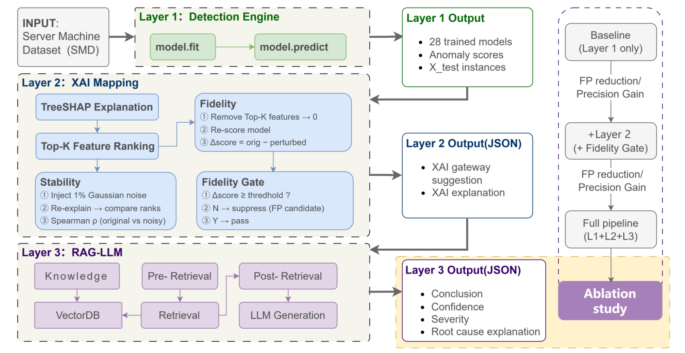

# X-RAG: Explainable RAG-Enhanced Anomaly Detection for Network Traffic

Three-layer end-to-end anomaly detection architecture: detection, attribution, diagnosis, with two false positive suppressions throughout the process.

## Architecture

- **Layer 1 — Detection Engine**: iForest, Train each of the 28 SMD machines separately and output the abnormal scores
- **Layer 2 — XAI Attribution**: TreeSHAP Feature attribution + Top-K sorting;Stability test (1% Gaussian noise + Spearman ρ) and Fidelity Gate (first false positive suppression)
- **Layer 3 — RAG-LLM Diagnosis**: Retrieval-Augmented Generation(RAG)  search for diagnosis + confidence level filtering (second suppression of false positives)

### Layer 1 — Detection
| Component | Choice                                 | Status     | Notes                                                                                                                                                                   |
|---|----------------------------------------|------------|-------------------------------------------------------------------------------------------------------------------------------------------------------------------------|
| Baselines compared | LOF, HBOS, COPOD, KNN, CBLOF, PCC, EIF | [ ] todo   |                                                                                                                                                                         |
| Detector | iForest                                | ✅ Selected | **preliminary result: Achieve the optimal balance among detection capability, efficiency, and false positive rate; the tree model is naturally compatible with TreeSHAP |

### Layer 2 — XAI Attribution
| Component | Choice | Status | Notes |
|---|--|---|---|
| Attribution | TreeSHAP | ✅ Selected | Tree structure precise Shapley value, zero approximation error |
| Stability check | 1% Gaussian noise + Spearman ρ | 🔨 Implementing | |
| Fidelity Gate | Top-K zeroing and re-ranking scoring | 🔨 Implementing | The threshold needs to be determined through experiments; the first FP inhibition |

### Layer 3 — RAG-LLM Diagnosis
| Component      | Choice                                                                           | Status | Notes                              |
|----------------|----------------------------------------------------------------------------------|---|------------------------------------|
| LLM candidates | Mistral-7B / Llama-3.1-8B / DeepSeek-R1 (distilled)                              | 📋 Planned | The end-to-end pipeline has been verified using large-scale APIs. The 7B/8B local candidates need to be re-tuned. The prompt must be independent of the candidate model to avoid self-assessment. |
| Embedding candidates     | all-MiniLM-L6-v2 (sentence-transformers)                                         | 📋 Planned | ased on the MiniLM architecture (Wang et al., 2020)   |
| Embedding      | all-MiniLM-L6-v2 (sentence-transformers)                                         | ❓ Open question| ased on the MiniLM architecture (Wang et al., 2020)   |
| Knowledge base | SMD Derivation: Training Set Statistical Profile + interpretation_labels history | 📋 Planned |              |
| Confidence filter | Confidence-based Filter                                                          | 📋 Planned | The second FP surpression          |
| Eval judge | ⚠️ TBD (GPT-4 class API preferred)                                               | ❓ Open question | It is necessary to be independent of the candidate model and avoid self-evaluation.                  |

图例：✅ confirmed | 🔨 developing | 📋 Planned | ❓ not decided

## Dataset
Server Machine Dataset (SMD), Su et al. (2019).

## Quick Start
pip install -r requirements.txt
- [ ] python scripts/run_layer1_2.py --config configs/default.yaml

## Project Info
Capstone project. Author: Zou Ting. 

## Model & Algorithm Registry

